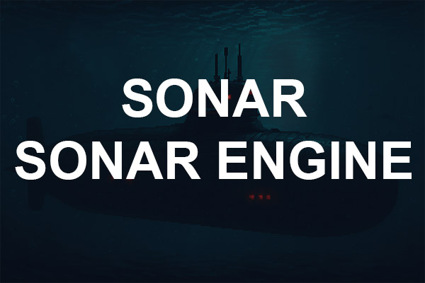

<!-- Improved compatibility of back to top link: See: https://github.com/othneildrew/Best-README-Template/pull/73 -->
<a id="readme-top"></a>
<!--
*** Thanks for checking out the Best-README-Template. If you have a suggestion
*** that would make this better, please fork the repo and create a pull request
*** or simply open an issue with the tag "enhancement".
*** Don't forget to give the project a star!
*** Thanks again! Now go create something AMAZING! :D
-->


<!-- PROJECT SHIELDS -->
<!--
*** I'm using markdown "reference style" links for readability.
*** Reference links are enclosed in brackets [ ] instead of parentheses ( ).
*** See the bottom of this document for the declaration of the reference variables
*** for contributors-url, forks-url, etc. This is an optional, concise syntax you may use.
*** https://www.markdownguide.org/basic-syntax/#reference-style-links
-->


<!-- PROJECT LOGO -->
<br />
<div align="center">
  <a href="https://github.com/blackcan1122/Sonar">
    
  </a>

<h3 align="center">Sonar</h3>

  <p align="center">
  This is a Mix of a Raylib c++ Framework and a Pixel Art Submarine Cold War Simulator. This Project will be splitted into 2 different ones, one for the Engine / Framework and one for the Game. At a later Point, Raylib will be replaced my a custom OpenGL / Vulkan implementation.
    <br />
    <a href="https://github.com/blackcan1122/Sonar"><strong>Explore the docs »</strong></a>
    <br />
    <br />
    <a href="https://github.com/blackcan1122/Sonar/issues/new?labels=bug&template=bug-report---.md">Report Bug</a>
    &middot;
    <a href="https://github.com/blackcan1122/Sonar/issues/new?labels=enhancement&template=feature-request---.md">Request Feature</a>
  </p>
</div>

<!-- ABOUT THE PROJECT -->
## About The Project

### <ins>SonarEngine</ins>:
#### Core Components:
* ##### GameInstance
The GameInstance class acts as the central authority for the game, managing the window properties, resource manager, event dispatchers, and the main game loop. It is responsible for initializing the game and handling the asset registry.
* ##### GameMode
The GameMode class is the core game state manager and object lifecycle controller. It handles object creation and destruction, frame-based tick execution, and provides lifecycle hooks for game-specific customization.
* ##### Object and Factory
The Object class represents the base class for all game objects, providing essential functionalities such as ticking and destruction marking. The Factory class is responsible for creating objects and managing their lifecycle within the game mode.
* ##### Event System
The event system includes the Event and EventDispatcher classes, which facilitate communication between different parts of the engine. Events can be dispatched and handled asynchronously, allowing for a decoupled architecture.
* ##### Resource Management
The ResourceManager class handles the loading and management of game resources such as textures. The SharedTexture2D class provides a reference-counted wrapper around texture resources, ensuring proper resource management and cleanup.
* ##### UI Components
The framework includes basic UI components such as Button, which can be constructed with various properties and event handlers. The MenuMode class demonstrates how to create a menu with interactive buttons.
* ##### Game Thread Queue
The GameThreadQueue class provides a thread-safe queue for enqueuing and processing tasks on the main game thread, ensuring that tasks are executed in a synchronized manner.

#### Examples:
##### Custom GameMode:
To create a custom game mode, inherit from the GameMode class and implement game-specific logic:
```cpp
#pragma once
#include "Base/Core.h"
#include "Base/GameMode.h"
class MyGameMode : public GameMode
{
  AUTOBODY(MyGameMode)
  public:
  virtual void Update() override
  {
    GameMode::Update();
  }
  virtual void BeginPlay() override;

    // Custom game logic here
};
```

All Functionality inside the Update() Function will automatically be called by the GameInstance.
But you should make Sure to call the BaseClass Update Function aswell.

##### Object Creation
To create a object (Any Class Derived from IObject / Object)
you should use the Factory, which every Class has.

```cpp
  SoftObjectPath<MyObjectType> MyObject = ObjectFactory.NewObject<MyObjectType>(constructor_args);
```
All Created Objects will be registered to the m_Objects array of the GameMode and also registered in the Asset Registry of the GameInstance
Each created Object will be assigned a Unique Name:
```cpp
  MyObject->GetName();
```
Which is a serialized Path to the Owner and Unique Name Like
```
MyGameMode/class.MyObject2
```

so with a SoftObjectPath we can easily get a temporaly lock on the actual Asset like:

```cpp
auto MyObjectPtr = MyObject->TryLoad()
if (MyObjectPtr)
{
  MyObjectPtr->SetMember(int 5);
}
```

if you are sure the Object is existing you can directly do
```cpp
MyObject->TryLoad()->SetMember(int 5);
```

this will not claim any ownership, as long as the return value of TryLoad isn't saved.

Each IObject can be marked for Destruction
when the Ref Amount goes to 0 (except the refs we always have) we will kill it
also you can kill it explicitly from the GameMode

Each IObject has a 
```
GetStaticClass()
```
and 

```
StaticClass()
```
`GetStaticClass` can be called on the Object directly and StaticClass on the Class
so when working with Interfaces like IObject you can use these for dynamic TypeChecking

```cpp
  auto MyObject = ObjectFactory.NewObject<MyObjectType>(constructor_args);

  auto MyRealObj = MyObject->TryLoad();

  auto MyCastedObj = std::dynamic_pointer_cast<IObject>(MyRealObj);

  std::cout << MyCastedObj->GetStaticClass().name() << std::endl;

```

will still print `MyObjectType`

```cpp
if (!Event && Event->GetStaticClass() != AllPurposeEvent::StaticClass())
{
	return;
}
```

its also important to note that every IObject created via the Factory, will its Tick() function automatically be called. So no need to manual call Tick()

##### Resources Managment
(right now only supports Texture2D)
Handles Loading Textures into Vram on the GPU.
To Load a Texture you have to define a .json
```
/resources/json/example.json
```

which looks like:
```json

{
    "Resources": [
        {
            "Name": "BackgroundMenu",
            "TextureID": 101,
            "TextureKind": "Texture2D", 
            "TextureNPatchInfo": null,
            "Path": "imgs\\BackgroundMenu.jpg",
            "Properties": {
                "Width": 3072,
                "Height": 2048,
                "Format": "RGBA",
                "WrapMode": "Repeat"
            }
        },
        {
            "Name": "ButtonImage",
            "TextureID": 102,
            "TextureKind": "NPatchTexture",
            "TextureNPatchInfo": {
                "SourceRect": { "x": 0, "y": 0, "width": 128, "height": 128 },
                "Padding": { "left": 32, "top": 32, "right": 32, "bottom": 32 },
                "HoverOffset": {"width" : 128, "height": 0},
                "Layout": "stretch"
            },
            "Path": "imgs\\9PatchTile.png",
            "Properties": {
                "Width": 256,
                "Height": 128,
                "Format": "RGBA"
            }
        }
    ]
}

```

Here you can define NPatchinfos, HoverOffsets etc.

When you want to Load a Texture into Vram you do:
```cpp
TextureResource* ButtonResource = GameInstance::GetInstance()->GetResource("ButtonImage");
SharedTexture2D Background = BackgroundResource->LoadTexture();
```
The TextureResource is the Owner of the underlying Texture2D and responsible for Loading and unloading the Texture from the GPU
TextureResource has a automatic Ref Counting mechanism, to know, if the SharedTexture2D is still used anywhere.
If the RefCount drops to 0, the GC will track this object Asynchron and clean its resource up, when its sure its not used anymore

SharedTexture2D has a automatic conversion operator to Texture2D so it can be used as normal

```cpp
TextureResource* ButtonResource = GameInstance::GetInstance()->GetResource("ButtonImage");
SharedTexture2D Background = BackgroundResource->LoadTexture();
DrawTexture(Background,0,0,WHITE);
```

### <ins>SonarGame</ins>:
The Game is not much implemented yet. At this point there exist a basic Waterfall Sonar Display, a Map and some Icons, as Moveable Submarines.
At this point, you need to build the Debug version to see the Sandbox GameMode to test stuff out

<p align="right">(<a href="#readme-top">back to top</a>)</p>

<!-- GETTING STARTED -->
## Getting Started

Use `build-VisualStudio2022.bat` to build a Visual Studio Solution.
All Prerequisites should be downloaded automatically

### Prerequisites

All Prerequisites should be automatically be downloaded via Premake and linked correctly

* [spdlog](https://github.com/gabime/spdlog)
* [nlohmann/json](https://github.com/nlohmann/json)
* [raylib](https://github.com/raysan5/raylib)

### Installation

1. 
```bash
git clone https://github.com/blackcan1122/Sonar.git
```
2. run `build-VisualStudio2022.bat` to build a .sln file

3. compile Debug Build for Sandbox GameMode

<p align="right">(<a href="#readme-top">back to top</a>)</p>


<!-- ROADMAP -->
## Roadmap
for both the Engine and the Game too much to list them here for now
- [ ] TODO
    - [ ] TODO

See the [open issues](https://github.com/blackcan1122/Sonar/issues) for a full list of proposed features (and known issues).

<!-- LICENSE -->
## License

Distributed inside the Project. See `LICENSE.txt` for more information.

<p align="right">(<a href="#readme-top">back to top</a>)</p>


<!-- CONTACT -->
## Contact

Marcel Schulz

Project Link: [Sonar](https://github.com/blackcan1122/Sonar)

<p align="right">(<a href="#readme-top">back to top</a>)</p>


<!-- MARKDOWN LINKS & IMAGES -->
<!-- https://www.markdownguide.org/basic-syntax/#reference-style-links -->
[contributors-shield]: https://img.shields.io/github/contributors/github_username/repo_name.svg?style=for-the-badge
[contributors-url]: https://github.com/github_username/repo_name/graphs/contributors
[forks-shield]: https://img.shields.io/github/forks/github_username/repo_name.svg?style=for-the-badge
[forks-url]: https://github.com/github_username/repo_name/network/members
[stars-shield]: https://img.shields.io/github/stars/github_username/repo_name.svg?style=for-the-badge
[stars-url]: https://github.com/github_username/repo_name/stargazers
[issues-shield]: https://img.shields.io/github/issues/github_username/repo_name.svg?style=for-the-badge
[issues-url]: https://github.com/github_username/repo_name/issues
[license-shield]: https://img.shields.io/github/license/github_username/repo_name.svg?style=for-the-badge
[license-url]: https://github.com/github_username/repo_name/blob/master/LICENSE.txt
[linkedin-shield]: https://img.shields.io/badge/-LinkedIn-black.svg?style=for-the-badge&logo=linkedin&colorB=555
[linkedin-url]: https://linkedin.com/in/linkedin_username
[product-screenshot]: images/screenshot.png
[Next.js]: https://img.shields.io/badge/next.js-000000?style=for-the-badge&logo=nextdotjs&logoColor=white
[Next-url]: https://nextjs.org/
[React.js]: https://img.shields.io/badge/React-20232A?style=for-the-badge&logo=react&logoColor=61DAFB
[React-url]: https://reactjs.org/
[Vue.js]: https://img.shields.io/badge/Vue.js-35495E?style=for-the-badge&logo=vuedotjs&logoColor=4FC08D
[Vue-url]: https://vuejs.org/
[Angular.io]: https://img.shields.io/badge/Angular-DD0031?style=for-the-badge&logo=angular&logoColor=white
[Angular-url]: https://angular.io/
[Svelte.dev]: https://img.shields.io/badge/Svelte-4A4A55?style=for-the-badge&logo=svelte&logoColor=FF3E00
[Svelte-url]: https://svelte.dev/
[Laravel.com]: https://img.shields.io/badge/Laravel-FF2D20?style=for-the-badge&logo=laravel&logoColor=white
[Laravel-url]: https://laravel.com
[Bootstrap.com]: https://img.shields.io/badge/Bootstrap-563D7C?style=for-the-badge&logo=bootstrap&logoColor=white
[Bootstrap-url]: https://getbootstrap.com
[JQuery.com]: https://img.shields.io/badge/jQuery-0769AD?style=for-the-badge&logo=jquery&logoColor=white
[JQuery-url]: https://jquery.com 
